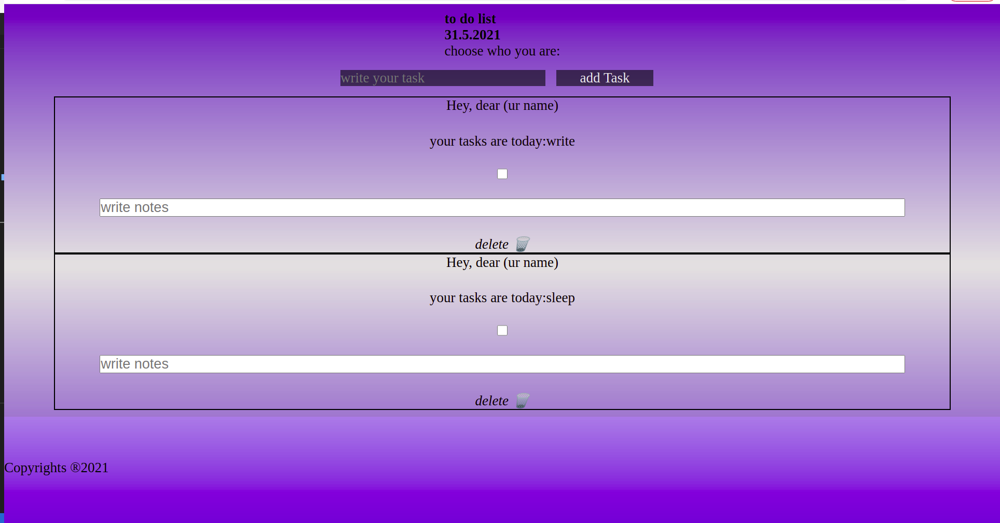

  

  <strong> planets with SASS </strong>
This is my official portfolio Website that i created using React.
examples of useState useEffect and useRef :

     
    <a href="https://github.com/AngelosPa/PortfolioWebsite/tree/main/src"><strong>Explore the files »</strong></a>
     
     
    <a href="https://angelospa.github.io/PortfolioWebsite/">View Demo</a>
    ·
    <a href="https://github.com/github_username/repo_name/issues">Report Bug</a>
    ·
    <a href="https://github.com/github_username/repo_name/issues">Request Feature</a>
  

